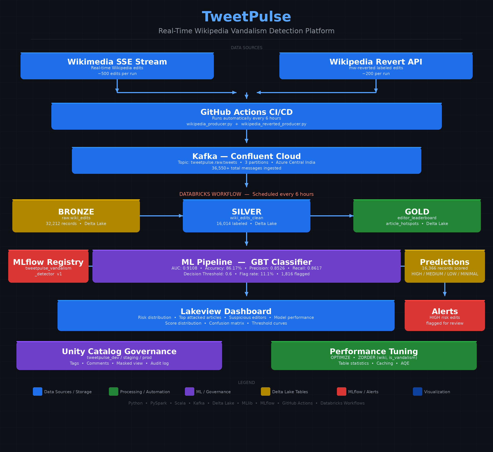

# TweetPulse — Real-Time Wikipedia Vandalism Detection


A end-to-end data engineering and machine learning platform built as a learning project to demonstrate production-grade skills across the modern data stack. The system ingests real Wikipedia edits from the Wikimedia SSE stream, processes them through a medallion architecture, trains a vandalism detection model, and serves predictions through an automated pipeline.

---

## Table of Contents

- [Project Overview](#project-overview)
- [Architecture](#architecture)
- [Tech Stack](#tech-stack)
- [Results](#results)
- [Project Structure](#project-structure)
- [Modules](#modules)
- [Setup](#setup)
- [Pipeline](#pipeline)
- [Known Limitations](#known-limitations)
- [Future Improvements](#future-improvements)

---

## Project Overview

Wikipedia receives thousands of edits every hour. A small fraction of these are vandalism — malicious edits that add false information, delete content, or insert inappropriate material. Wikipedia relies on volunteer moderators and bots like ClueBot NG to detect and revert vandalism.

TweetPulse is a learning project that builds a complete data engineering pipeline to:

- **Ingest** real Wikipedia edits from the Wikimedia SSE stream via Kafka
- **Process** edits through Bronze → Silver → Gold medallion architecture on Databricks
- **Train** a Gradient Boosted Trees classifier to detect vandalism
- **Score** every edit with a vandalism probability (0.0 to 1.0)
- **Serve** predictions through an automated Databricks Workflow running every 6 hours
- **Visualize** results on a live Databricks Lakeview Dashboard

The project covers 17 modules spanning data ingestion, streaming, transformation, data quality, ML training, model serving, CI/CD, governance, and performance tuning.

---

## Architecture

---

## Tech Stack

| Layer | Technology | Purpose |
|-------|-----------|---------|
| Streaming | Wikimedia SSE, Kafka (Confluent) | Real-time edit ingestion |
| Compute | Databricks Community Edition (Serverless) | Distributed processing |
| Storage | Delta Lake, Unity Catalog | ACID transactions, governance |
| Processing | PySpark, Spark SQL, Pandas UDFs | Data transformation |
| ML | PySpark MLlib, MLflow | Model training and tracking |
| Orchestration | Databricks Workflows | Pipeline automation |
| CI/CD | GitHub Actions | Data collection automation |
| Languages | Python, Scala, SQL | Full stack |
| Governance | Unity Catalog, Delta Lake | Access control, lineage |

---

## Results

### Data Pipeline

| Metric | Value |
|--------|-------|
| Total records ingested | 16,014 |
| Vandalism records (labeled) | 3,143 (19.6%) |
| Legitimate records (labeled) | 12,871 (80.4%) |
| Data sources | Wikimedia SSE + Wikipedia Revert API |
| Pipeline latency | < 6 hours end-to-end |

### ML Model (Gradient Boosted Trees)

| Metric | Value |
|--------|-------|
| AUC | 0.9108 |
| Accuracy | 86.17% |
| F1 Score | 0.8547 |
| Precision | 0.8526 |
| Recall | 0.8617 |
| Decision threshold | 0.6 |
| Flag rate | 11.1% |

### Top Feature Importances

| Feature | Importance | Description |
|---------|-----------|-------------|
| bytes_changed | 12.6% | Edit size — large deletions are suspicious |
| author_avg_bytes | 11.6% | User's typical edit size |
| author_unique_articles | 11.6% | Scattered editing is suspicious |
| author_edit_count | 10.9% | New accounts are higher risk |
| author_vandalism_rate | 7.3% | Prior vandalism predicts future |

### Data Quality

| Layer | Records | Pass Rate |
|-------|---------|-----------|
| Bronze | 16,014 | 100% |
| Silver | 16,014 | 99.9% |
| Quarantine | 0 | — |

---

## Project Structure

\`\`\`
tweetpulse/
├── .github/
│   └── workflows/
│       ├── collect_data.yml                    # Runs producers every 6 hours
│       └── test.yml                            # Runs tests on every push
├── src/
│   ├── python/
│   │   ├── ingestion/
│   │   │   ├── wikipedia_producer.py           # SSE stream producer
│   │   │   └── wikipedia_reverted_producer.py  # Labeled vandalism producer
│   │   ├── bronze/
│   │   ├── silver/
│   │   ├── gold/
│   │   ├── ml/
│   │   └── utils/
│   └── scala/
│       ├── build.sbt
│       ├── kafka.properties
│       └── src/
│           ├── main/scala/com/tweetpulse/
│           │   ├── TweetDomain.scala           # Domain models (28 tests)
│           │   └── MockTweetProducer.scala     # Kafka producer (14 tests)
│           └── test/scala/com/tweetpulse/
│               ├── TweetDomainSpec.scala
│               └── MockTweetProducerSpec.scala
├── tests/
│   ├── unit/
│   └── integration/
├── bundles/
│   └── databricks.yml                          # Databricks Asset Bundle config
├── infra/
│   └── terraform/
├── notebooks/
├── architecture.png
├── docker-compose.yml
└── README.md
---

## Modules

| Module | Description | Status |
|--------|-------------|--------|
| M01 | Scaffold, Unity Catalog, Secrets | ✅ Complete |
| M02-A | Scala fundamentals (28/28 tests) | ✅ Complete |
| M02-B | Kafka producer in Scala (14/14 tests) | ✅ Complete |
| M03 | Bronze layer ingestion — Structured Streaming | ✅ Complete |
| M04-A | PySpark DataFrame functions | ✅ Complete |
| M04-B | Date/time and window functions | ✅ Complete |
| M04-C | UDFs and Pandas UDFs | ✅ Complete |
| M05 | Silver layer — cleaning and transformation | ✅ Complete |
| M06 | Delta Live Tables (conceptual) | ✅ Complete |
| M07 | Gold layer — aggregations | ✅ Complete |
| M08 | Streaming deep dive — watermarks, windows, joins | ✅ Complete |
| M09 | Data quality — rules, quarantine, profiling | ✅ Complete |
| M10 | ML pipeline — GBT classifier, MLflow tracking | ✅ Complete |
| M11 | Model serving — batch inference, risk scoring | ✅ Complete |
| M12 | Visualization — Lakeview Dashboard | ✅ Complete |
| M13 | CI/CD — GitHub Actions | ✅ Complete |
| M14 | Databricks Workflows DAG | ✅ Complete |
| M15 | Unity Catalog governance | ✅ Complete |
| M16 | Performance tuning — OPTIMIZE, ZORDER | ✅ Complete |
| M17 | Capstone and portfolio | ✅ Complete |

---

## Setup

### Prerequisites

- Databricks Community Edition account
- Confluent Cloud account (free tier)
- Python 3.11+
- Java 11 (for Scala)
- SBT 1.12+

### Environment Setup

```bash
# Clone repository
git clone https://github.com/Nitantv/tweetpulse.git
cd tweetpulse

# Create Python virtual environment
python3 -m venv tweetpulse-env
source tweetpulse-env/bin/activate

# Install dependencies
pip install kafka-python requests pytest
```

### Kafka Configuration

Set environment variables:
```bash
export KAFKA_KEY="your_confluent_api_key"
export KAFKA_SECRET="your_confluent_api_secret"
export KAFKA_BOOTSTRAP="your_bootstrap_server"
```

### Run Data Collection

```bash
# Collect stream edits
python3 src/python/ingestion/wikipedia_producer.py 1000

# Collect labeled vandalism data
python3 src/python/ingestion/wikipedia_reverted_producer.py 500
```

### Databricks Setup

1. Import all notebooks (M03-M16) into Databricks workspace
2. Run notebooks in order: M03 → M05 → M07 → M10 → M11
3. Create TweetPulse Pipeline workflow with 4 tasks
4. Schedule every 6 hours

---

## Pipeline

### Automated Data Flow
Every 6 hours:
GitHub Actions
→ wikipedia_producer.py (500 edits)
→ wikipedia_reverted_producer.py (200 labeled)
→ 700 new records sent to Kafka
Databricks Workflow:
Task 1: ingest_bronze   → Kafka → Delta Bronze
Task 2: transform_silver → Bronze → Silver
Task 3: build_gold      → Silver → Gold aggregations
Task 4: score_ml        → Silver → Vandalism predictions
### Medallion Architecture

**Bronze** — Raw Wikipedia edits exactly as received from Kafka. No transformations. Schema: id, text, title, author, wiki, created_at, bytes_changed, is_bot, is_vandalism, kafka metadata.

**Silver** — Cleaned and enriched edits. Wikipedia markup removed from comments. Features engineered: edit_category, editor_type, word_count, bytes_kb, hour_of_day. Labels applied: is_vandalism from reverted producer or keyword detection.

**Gold** — Business-level aggregations. Editor leaderboard with vandalism rates. Article hotspots with edit frequency. Vandalism predictions with risk levels (HIGH/MEDIUM/LOW/MINIMAL).

---

## Known Limitations

**Label quality** — Training labels come from two sources with different quality. Records from the Wikipedia Revert API (`mw-reverted` tag) are strongly labeled — confirmed vandalism. Records from the SSE stream are weakly labeled using keyword matching on edit comments — approximately 70-80% accurate. A production system would use only strongly labeled data.

**Label direction** — The reverted producer fetches the revert edit (moderator writing "Reverted vandalism by user X") rather than the original vandalism edit. The model learns to detect reverts, not the original vandalism. A production system would fetch the actual vandalized revision.

**Data volume** — 16,014 training records is sufficient for a learning project but small for production. ClueBot NG trains on millions of edits. More data would improve model accuracy.

**Community Edition limitations** — Databricks Community Edition does not support column masking, row-level security, real-time model serving endpoints, or Delta Live Tables. A production deployment on Databricks Premium would implement these features.

**Coverage** — Only English Wikipedia (enwiki) is covered. A production system would extend to all language editions.

---

## Future Improvements

- **Better labels** — Fetch actual vandalized revisions instead of revert edits using Wikipedia's revision API
- **More data** — Scale to 1M+ training records for significantly higher accuracy
- **Real-time serving** — Deploy model as REST endpoint on Databricks Premium for sub-second scoring
- **Column masking** — Implement GDPR-compliant author pseudonymization using Unity Catalog column masks
- **Multi-language** — Extend pipeline to cover all Wikipedia language editions
- **Model retraining** — Implement weekly automated retraining with model promotion workflow
- **Alerting** — Add email/Slack alerts when HIGH risk edits are detected
- **DABs deployment** — Deploy using Databricks Asset Bundles for proper dev/staging/prod promotion
- **Feature store** — Move author behavioral features to Databricks Feature Store for reuse across models
- **Online features** — Add real-time feature computation for author edit velocity

---

## License

MIT License — free to use for learning and portfolio purposes.